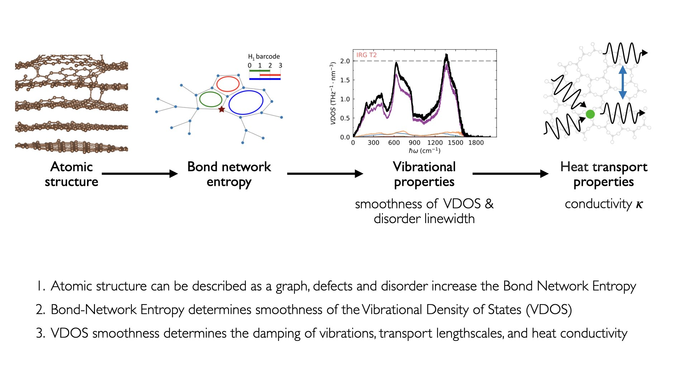

Smooth Disorder Library
=======================

.. image:: _static/news_image.png
   :alt: Irradiated graphite visualized with coordination number (left) and H1 barcode descriptors (right)
   :width: 100%
   :align: center

Smooth Disorder is a Python library that smoothly explains influence of structural disorder
on the smoothness of vibrational density of states and interprets it in terms
of disorder linewidth that decomposes diffusivity into propagation velocity and mean free path.

The library introduces three main functionalities:

- calculation of **Allen-Feldman (AF) conductivity** and diffusivity starting from a structure's unit cell and second order force constants,
- computation of **Bond-Network Entropy (BNE)**, which is a descriptor of disorder for network solids,
- fitting of **Disorder Linewidth (DL)**, which is a measure of scattering due to disorder and allows decomposition of diffusivity in disordered materials.

All together, these form complementary tools for connecting structural disorder to thermal transport:

**Allen-Feldman conductivity** is a standard expression for thermal conductivity and diffusivity for harmonic disordered solids based on atomic structure and interactions between atoms.
The other tools in the library allow for more in-depth understanding of its predictions and how they depend on the degree of disorder.

**Bond-Network Entropy** classifies local atomic environments using H1
persistent homology barcodes and summarises their distribution with a single
Shannon entropy value. Higher BNE means greater heterogeneity — more disorder.

**Disorder Linewidth** connects structural disorder to phonon linewidths and
thermal transport. It models how disorder broadens the vibrational density of
states (VDOS) via a Lorentzian spectral function ansatz, fits two physical
parameters — grain-boundary size *L* and defect-scattering amplitude *R* —
to the disordered VDOS using PyTorch autodiff (L-BFGS), and decomposes thermal
diffusivity into propagation velocity and mean free path.

The concepts of BNE and DL relate the atomic structure to the conductivity via a set of physical relations, for more information see the package's corresponding paper.

.. warning::

   We encourage users to first go through the tutorials that explain the theory behind concepts used and quantities calculated by this code.
   If the users are interested only in executing the code, then workflows are provided that calculate both BNE and DL, use at your own risk.

**Corresponding Paper:** K. Iwanowski, G. Csányi, and M. Simoncelli,
*Physical Review X* **15**, 041041 (2025) —
`DOI: 10.1103/w4p6-b9mp <https://doi.org/10.1103/w4p6-b9mp>`_

**Library Authors:** Kamil Iwanowski, Michele Simoncelli (Columbia University)

----

.. toctree::
   :maxdepth: 1
   :caption: Getting started

   install

.. toctree::
   :maxdepth: 1
   :caption: Background Theory

   theory/index

.. toctree::
   :maxdepth: 1
   :caption: Tutorials

   tutorials/index

.. toctree::
   :maxdepth: 1
   :caption: Workflows

   workflows/index

.. toctree::
   :maxdepth: 1
   :caption: API Reference

   api/index

.. toctree::
   :maxdepth: 1
   :caption: About

   citation
