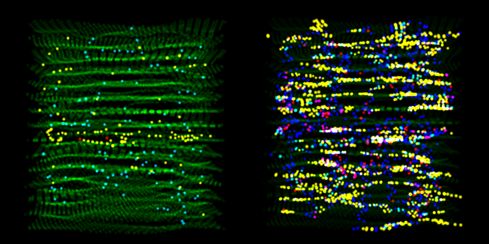
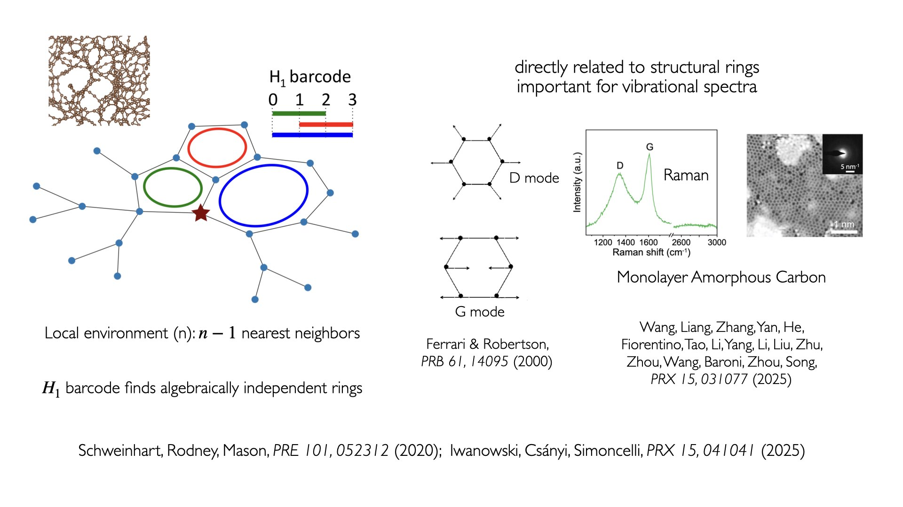
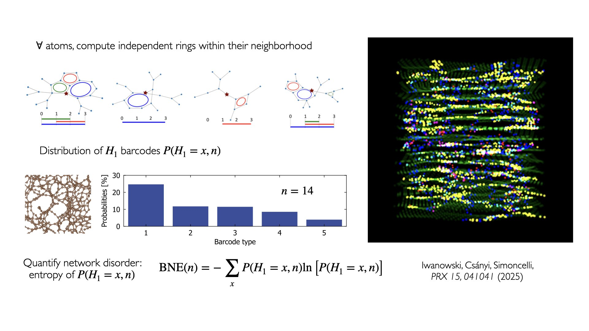
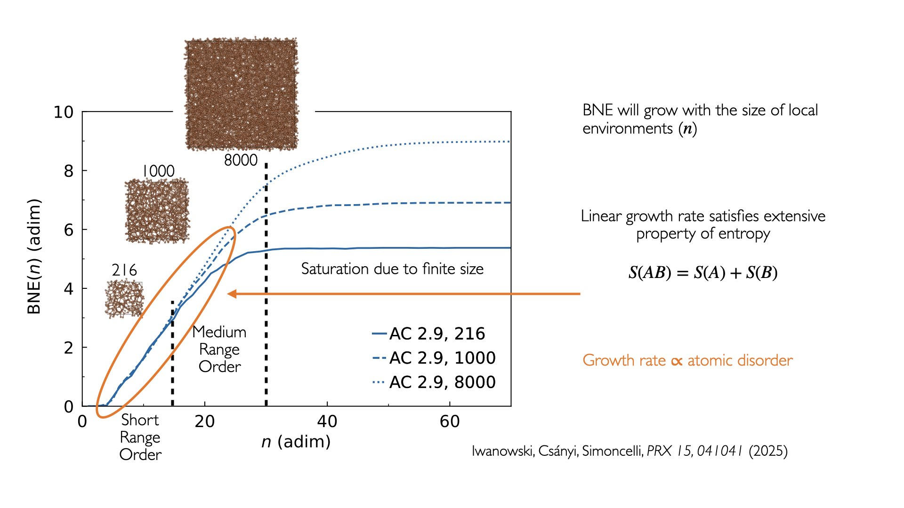

Bond-Network Entropy Tutorials
==============================

A step-by-step series covering the full BNE pipeline for silica glass, from raw
structure file to growth-rate analysis. Below we show schematics for how BNE is calculated
from local environments, H1 barcodes and their distributions.

Around a single atom, we collect its neighbors and create a graph of connections.
In this graph we look for rings (cycles) and we can do this in an automated way using
a quantity called H1 barcode, which finds algebraically independent rings, 
see Schweinhart et al., PRE (2020) and Iwanowski et al., PRX (2025) for more details.
Characterization of rings within a local environment is important, as there is 
prior evidence that structural rings are important for vibrational spectra, e.g., breathing mode
of the 6-carbon ring is responsible for the D-peak in the Raman spectra of carbon. (Ferrari & Robertson, PRB (2000))

To characterize disorder we calculate H1 barcodes for all atoms with a specific size of the local atomic environment (LAE) :math:`n`.
From that, we obtain a distribution of H1 barcodes and we can quantify network disorder through the entropy of that distribution,
which we call Bond-Network Entropy. It crucially depends on the number of atoms in the local environment :math:`n`.
The picture on the right shows Irradiated Graphite T2 visualized with atoms colored depending on their H1 barcode, 
size of LAE equal to 14 and showing significant variability between environments. 
This is in contrast to the visualization of atoms when they're colored according to coordination number (left side of the top figure on this page),
showing the dominance of three-coordinated atoms.

Finally we analyze the dependence of BNE on LAE size :math:`n` for three structures of amorphous carbon with different amount of atoms in the unit cell.
We see that BNE increases with the LAE size for low values of :math:`n` (the Short and Medium Range Order regimes) 
and saturates at higher values of :math:`n` due to the finite size of the structure's unit cell.
The growth rate of BNE outside of the saturation regime is informative of the structural disorder in a given structure.

**Prerequisites:** BNE installation (``bash setup_bne.sh`` or
``pip install -e ".[jupyter]"``). Remember to ``source .venv_bne/bin/activate`` before running the notebooks.

.. list-table::
   :header-rows: 1
   :widths: 5 45 50

   * - Step
     - Notebook
     - Topic
   * - 1
     - ``1_structure_preparation_and_bonding``
     - Load a structure (POSCAR/CIF/XYZ), compute pairwise MIC distances, identify the bond cutoff
   * - 2
     - ``2_plot_coordination_number_distribution``
     - Build the adjacency matrix, plot coordination number distributions
   * - 3
     - ``3_H1_barcode``
     - Extract local atomic environments, compute H₁ persistent homology barcodes
   * - 4
     - ``4_Bond_Network_Entropy``
     - Compute the full barcode distribution, calculate BNE via Shannon entropy
   * - 5
     - :doc:`bne_scripts/5_BNE_workflow` *(terminal script)*
     - Compute BNE for all LAE sizes 1-80; saves HDF5 results for Notebook 6
   * - 6
     - ``6_BNE_growth_rate``
     - Plot BNE vs LAE size, compute growth rate and saturation behaviour

.. note::

   Notebook 6 requires pre-computed data. Either run
   :doc:`bne_scripts/5_BNE_workflow` first, or use the pre-computed reference
   data already included in ``tutorials/bond_network_entropy/data/``.

.. toctree::
   :maxdepth: 1
   :hidden:

   bne_notebooks/1_structure_preparation_and_bonding
   bne_notebooks/2_plot_coordination_number_distribution
   bne_notebooks/3_H1_barcode
   bne_notebooks/4_Bond_Network_Entropy
   bne_scripts/5_BNE_workflow
   bne_notebooks/6_BNE_growth_rate
