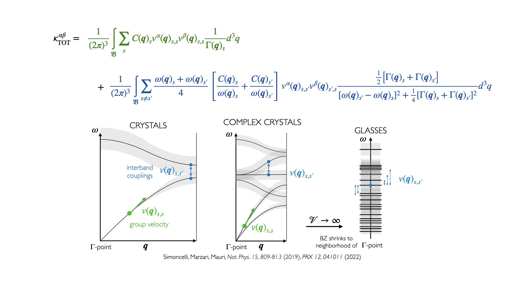
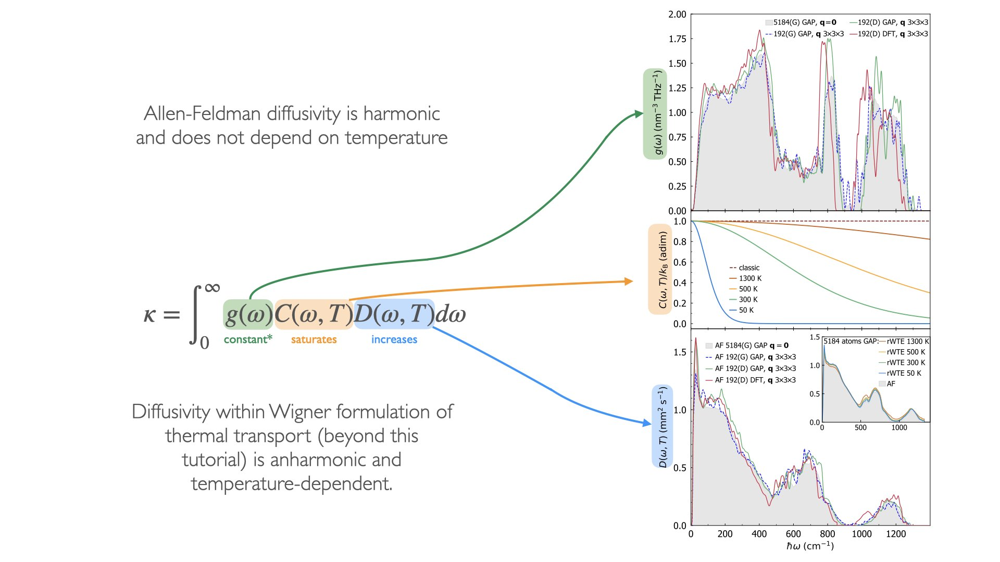

Allen-Feldman Diffusivity Tutorial
==================================

A terminal-script series covering the full Allen-Feldman (AF) diffusivity
workflow for irradiated graphite (IRG T9, 216-atom unit cell). The computed
diffusivity and frequency data can be used as inputs for the Disorder Linewidth
fitting workflow.

**Background Theory:** 

  
The conductivity expression within Wigner formulation of thermal transport in the 
Relaxation Time Approximation (RTA) is given by the above expression in the visualization. 
It is a sum of two terms: 

- propagation term (green) equivalent to the Boltzmann transport equation within RTA and a
- tunneling term (blue) which accounts for contributions to heat transport from couplings between vibrational modes. 

The second term is the dominant term in the disordered solids, when eigenvectors of the dynamical matrix are real
and reduces to Allen-Feldman (AF) diffusivity expression in the limit of large unit cells :math:`\mathcal{V} \rightarrow \infty` 
and vanishing anharmonic linewidths :math:`\Gamma(\mathbf{q})_s \rightarrow 0`. 
In that limit, the last Lorentzian-like fraction becomes a delta function multiplied by pi :math:`\pi \delta(\omega(\mathbf{q})_s - \omega(\mathbf{q})_{s'})`.

To calculate the diffusivity expression for models with finite size, the theoretical narrow delta function 
needs to be broadened e.g., assume a Gaussian distribution function with a smearing value :math:`\eta`, 
to allow for physical couplings between vibrational modes.
It is chosen in such a way, that the final :math:`\eta` value is within the convergence plateau region, 
where the AF conductivity prediction does not depend on :math:`\eta`.
We also use :math:`\mathbf{q}`-mesh convergence acceleration protocol to achieve converged results 
for thermal conductivity predictions using small models of disordered systems,
for more details see the Wigner formulation of thermal transport section in the corresponding paper.

Thermal conductivity expression can be rewritten in terms of an integral of the vibrational density of states, 
specific heat and the diffusivity (see above image). These are natural quantities to work with in disordered systems.

The first script `1a_calc_vel_ops.py` calculates the velocity operator elements :math:`v(\mathbf{q})_{s, s'}` on a :math:`\mathbf{q}`-mesh,
the files 2a, 2b, 2c plot the :math:`\eta` convergence plateau, the files 3c, 3b compute and postprocess the AF conductivity predictions,
and 4a file prepares the frequencies and diffusivity predictions for the disorder linewidth workflow.

**Prerequisites:** phono3py environment, see `setup_phono3py.sh` and `tutorials/diffusivity/activate_phono3py.sh`.

.. important::

   ``fc2.hdf5`` (second-order force constants for IRG T9) is not included in the repository
   because of its size. Download it from `Google Drive <https://drive.google.com/drive/folders/16loux_gkvg3oDMCR8urRwfGbaMyPewpc?usp=sharing>`_ and place it in
   ``tutorials/diffusivity/`` before running any scripts.

.. list-table::
   :header-rows: 1
   :widths: 5 55 40

   * - Step
     - Script
     - Topic
   * - 1a
     - :doc:`diffusivity_scripts/1a_calc_vel_ops`
     - Compute velocity-operator matrix elements at each irreducible q-point; save to ``velocity_operators/save_{iq}.hdf5``
   * - 2a
     - :doc:`diffusivity_scripts/2a_convergence_serial`
     - Run AF convergence study over a range of Lorentzian smearings and temperatures
   * - 2b
     - :doc:`diffusivity_scripts/2b_save_convergence`
     - Collect per-q convergence results and save summary arrays
   * - 2c
     - :doc:`diffusivity_scripts/2c_plot_convergence`
     - Plot diffusivity convergence vs smearing; use to determine the optimal η
   * - 3a
     - :doc:`diffusivity_scripts/3a_tensor_conductivity_save`
     - Compute the AF conductivity tensor for a single q-point and mode range (called by 3c)
   * - 3b
     - :doc:`diffusivity_scripts/3b_tensor_conductivity_save_process`
     - Assemble per-q-point conductivity tensors into a single ``IC_dataset_tensor.npz``
   * - 3c
     - :doc:`diffusivity_scripts/3c_launch_serial`
     - Serial launcher: iterates over all q-points and mode batches, calling ``3a`` for each
   * - 4a
     - :doc:`diffusivity_scripts/4a_prepare_inputs_for_dl_fitting`
     - Extract frequencies and weights from the assembled dataset; save as HDF5 for the DL workflow

.. note::

   The workflow runs in order: **1a → 2a → 2b → 2c → 3c → 3b → 4a**.
   Steps 2a–2c are a convergence study to determine the Lorentzian
   smearing η; run them before 3c and select the optimal value to be put in the 3c script.
   All scripts must be run from ``tutorials/diffusivity/`` with the phono3py
   environment active.

.. toctree::
   :maxdepth: 1
   :hidden:

   diffusivity_scripts/1a_calc_vel_ops
   diffusivity_scripts/2a_convergence_serial
   diffusivity_scripts/2b_save_convergence
   diffusivity_scripts/2c_plot_convergence
   diffusivity_scripts/3a_tensor_conductivity_save
   diffusivity_scripts/3b_tensor_conductivity_save_process
   diffusivity_scripts/3c_launch_serial
   diffusivity_scripts/4a_prepare_inputs_for_dl_fitting
