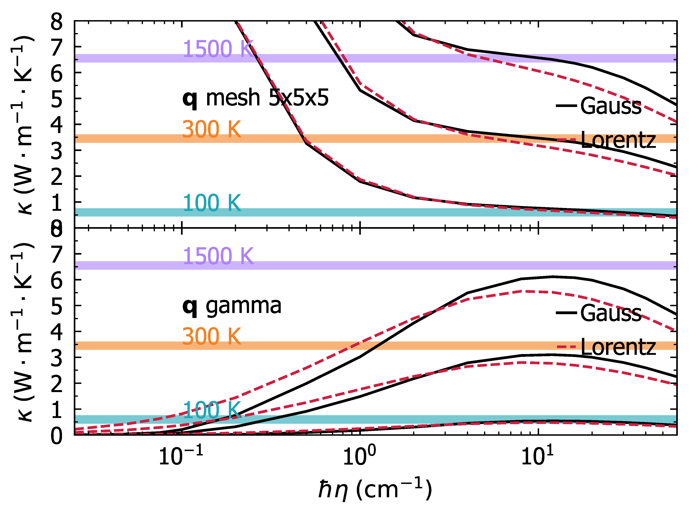

2c\_plot\_convergence.py — Plot Smearing Convergence
======================================================

Plots the Allen-Feldman conductivity as a function
of Lorentzian smearing η at each temperature. The plateau region in the plot
identifies the physically meaningful smearing value to use in the final
diffusivity calculation (step 3).

Output figures are saved to files (Agg backend; no display required).

**Run after** ``2b_save_convergence.py``.

.. code-block:: bash

   cd tutorials/diffusivity
   python 2c_plot_convergence.py

The output of the code will be a pdf containing the convergence plateau data at three temperatures: 100, 300 and 1500K:

The smearing :math:`\eta` value is chosen such that it is the lowest value at which
Allen-Feldman thermal conductivity is within the region of the convergence plateau (it converges).
For the IRG T9, the plateau at the gamma point is between ~7 to ~20 :math:`\text{cm}^{-1}`,
and on the 5×5×5 mesh between ~4 and ~12 :math:`\text{cm}^{-1}`, so the final chosen value of 8 :math:`\text{cm}^{-1}`
is well within the convergence region (see ``gamma_min_plateau_cmm1 = 8.0`` in the ``3c_launch_serial.py`` script).

.. literalinclude:: 2c_plot_convergence.py
   :language: python
   :linenos: