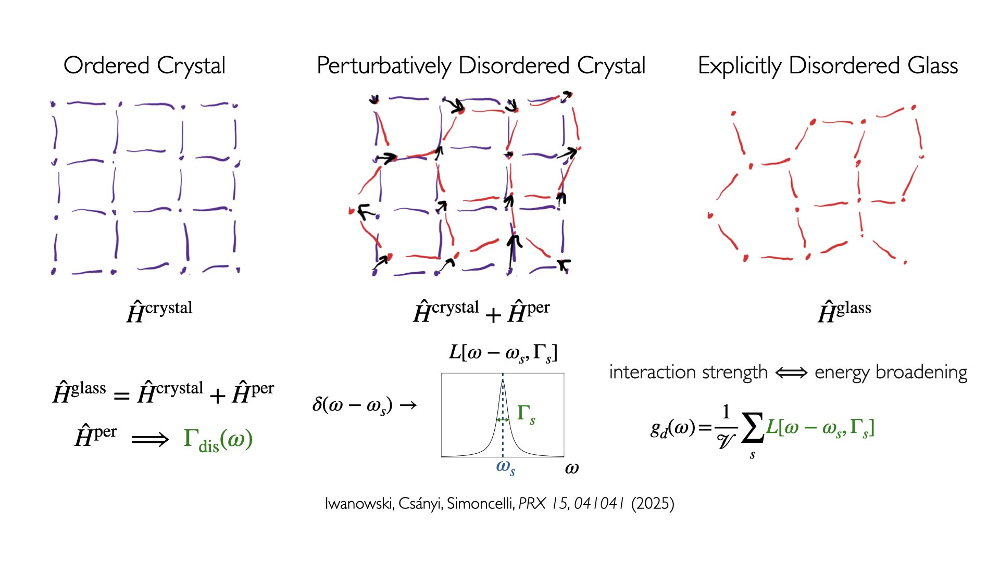
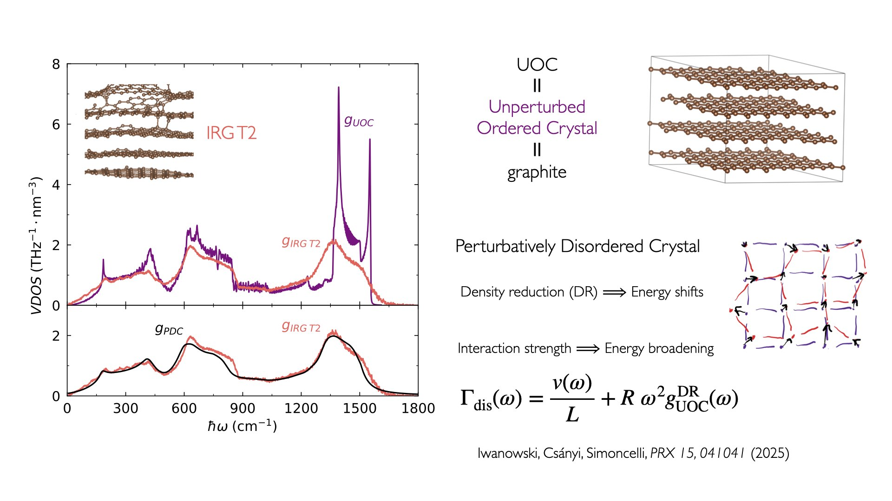
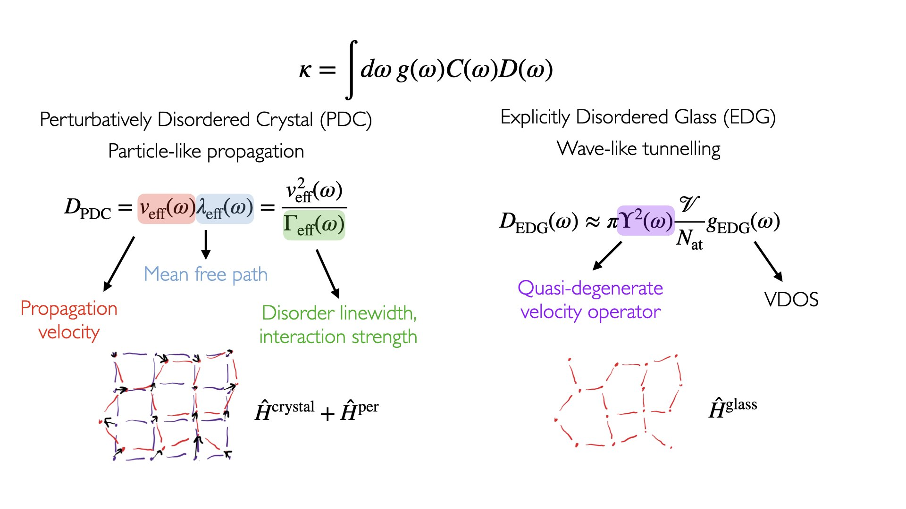

Disorder Linewidth Tutorials
============================

A six-notebook series covering the full DL pipeline for irradiated graphite,
from phonon band structure and VDOS to disorder linewidth fitting and thermal
transport decomposition. 
We heavily recommend new users to also see the corresponding paper (PRX 15, 041041 (2025)) that explains
how disorder linewidth is derived and the meaning behind the mapping between Perturbatively Disordered Crystal (PDC)
and Explicitly Disordered Glass (EDG). Below we explain main features of the 
mapping in a presentation-style rundown.

The central idea behind the mapping is we can account for influence of disorder starting from a reference crystal
(Unperturbed Ordered Crystal, UOC) in two ways:

- explictly, by accounting for the full Hamiltonian :math:`\hat{H}^{\rm glass}` in the dynamical matrix, and diagonalizing it to obtain vibrational modes. 
  This approach is called Explicitly Disordered Glass and it can be used to calculate diffusivity using the Wigner formulation of thermal transport. 
  The VDOS is broadened in this approach due to vibrational mode repulsion induced by disorder.
- perturbatively, by only diagonalizing the crystal part of the Hamiltonian :math:`\hat{H}^{\rm crystal}` and 
  including the influence of the rest of the Hamiltonian :math:`\hat{H}^{\rm per} = \hat{H}^{\rm glass} - \hat{H}^{\rm crystal}` on phonon scattering.
  This approach is called a Perturbatively Disordered Crystal. In practice we don't derive the form of the Hamiltonian :math:`\hat{H}^{\rm per}`,
  instead we look at the influence of this Hamiltonian on the VDOS, and interpret it in the language of phonon spectral functions.
  In simplest terms, if a vibration scatters due to interactions, it has a finite lifetime, and this lifetime would lead to an energy uncertainty, hence linewidth and energy broadening.
  This broadening of the vibrational excitations is responsible for the smoothness of the VDOS in the PDC picture.

The corresponding paper sets up a mapping between these two treatments 
that allows us to equate the VDOS and diffusivity in a PDC with corresponding quantities in an EDG.
We find that the methodology can transform the VDOS of Unperturbed Ordered Crystal into the VDOS of a 
Perturbatively Disordered Crystal that matches the VDOS of an Explicitly Disordered Glass; 
this is shown explicitly in the left figure of the above image. Scattering due to disorder leads to 
broadening of phonon spectral functions and hence broadening of the PDC VDOS. We fit this broadening (disorder linewidth)
as a function of frequency using two terms: 1) Casimir grain boundary scattering term with parameter :math:`L` 
and a 2) Rayleigh-like defect scattering term with parameter :math:`R`. In the PDC VDOS we also account 
for frequency shifts due to changes in the density induced by irradiation, concept which is more explored in the third notebook.

By matching Vibrational Densities of States :math:`g(\omega)` of PDC and EDG, we can match also their diffusivities :math:`D(\omega)` and their conductivity predictions.
This constitutes the full PDC-EDG mapping and allows us to decompose the diffusivity calculated for a disordered system,
in terms of quantities appearing in a Perturbatively Disordered Crystal, namely propagation velocity :math:`v_{\rm eff}(\omega)` 
and mean free path :math:`\lambda_{\rm eff}(\omega)`. This decomposition is performed in the notebook 5.

**Prerequisites:** BNE + DL installation (see `setup_dl.sh`). Remember to ``source .venv_dl/bin/activate`` before running the notebooks.

.. list-table::
   :header-rows: 1
   :widths: 5 50 45

   * - Step
     - Notebook
     - Topic
   * - 1
     - ``1_crystals_and_BTE_vs_disordered_systems``
     - Phonon band structure of crystal graphite; BTE in simple crystals vs WTE in disordered systems
   * - 2
     - ``2_VDOS_comparison_between_crystal_and_irradiated_graphite``
     - Compute VDOS for crystal and irradiated graphite; disorder-induced broadening
   * - 3
     - ``3_Debye_model_and_Lorentzian_spectral_functions``
     - Debye model, Lorentzian spectral functions, and the defect-scattering linewidth ansatz
   * - 4
     - ``4_frequency_shift_correction``
     - Frequency-shift correction to align crystal and disordered VDOS
   * - 5
     - ``5_disorder_linewidth_and_mean_free_path``
     - Disorder linewidth, phonon mean free path, and their relation to thermal transport
   * - 6
     - ``6_fit_disorder_linewidth_parameters``
     - Fit *L* and *R* parameters with L-BFGS via PyTorch autodiff

The pipeline can also be run end-to-end as a sequence of three terminal scripts
(no Jupyter required):

.. list-table::
   :header-rows: 1
   :widths: 5 50 45

   * - Step
     - Script
     - Topic
   * - 7a
     - :doc:`dl_scripts/7a_workflow_precompute_quantities`
     - Band structure, phonon mesh, crystal and disordered VDOS, density shift (mirrors Notebooks 1-4)
   * - 7b
     - :doc:`dl_scripts/7b_fit_dl_parameters`
     - Fit *L* and *R* via L-BFGS; saves ``model_parameters.hdf5`` (mirrors Notebook 6)
   * - 7c
     - :doc:`dl_scripts/7c_diffusivity_decomposition`
     - Disorder linewidth, PDC VDOS, propagation velocity, mean free path (mirrors Notebook 5)

.. note::

   Run the scripts in order (7a → 7b → 7c) from ``tutorials/disorder_linewidth/``.
   Each script reads HDF5 files written by the previous one.

.. toctree::
   :maxdepth: 1
   :hidden:

   dl_notebooks/1_crystals_and_BTE_vs_disordered_systems
   dl_notebooks/2_VDOS_comparison_between_crystal_and_irradiated_graphite
   dl_notebooks/3_Debye_model_and_Lorentzian_spectral_functions
   dl_notebooks/4_frequency_shift_correction
   dl_notebooks/5_disorder_linewidth_and_mean_free_path
   dl_notebooks/6_fit_disorder_linewidth_parameters
   dl_scripts/7a_workflow_precompute_quantities
   dl_scripts/7b_fit_dl_parameters
   dl_scripts/7c_diffusivity_decomposition